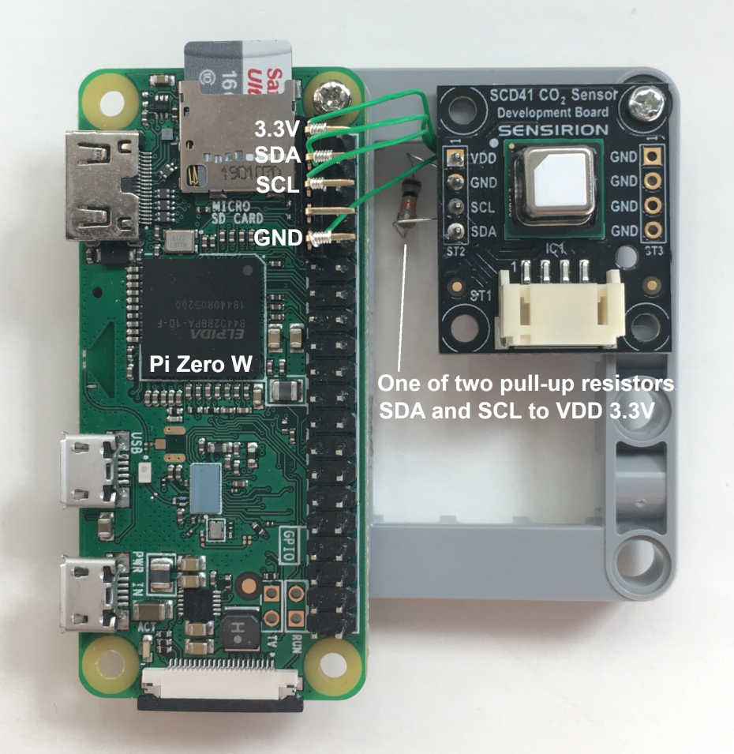

# Threejs-VR-Carbon-Dioxide-Sensor
A project to explore measurement of carbon dioxide concentration and presenting the numbers in virtual reality. 

Learn to interface a Sensirion SCD41 carbon dioxide sensor to a Raspberry Pi and an Oculus Quest to 3D map carbon dioxide levels. 

## Threejs-VR-Physics Pages

[https://physicslibrary.github.io/Threejs-VR-Carbon-Dioxide-Sensor/](https://physicslibrary.github.io/Threejs-VR-Carbon-Dioxide-Sensor/)

## System Requirements

Oculus Quest (tested Quest 1, no controllers) 

Oculus Browser >15.4 (Quest update 29.0) 

Not sure if Oculus Browser needs to be configured for WebXR like in the early days. If the simulation below does not work, type "chrome://flags" in Oculus Browser and search for "webxr". "WebXR experiences with hand and joints tracking" and "WebXR Layers" are enabled. 

Codes for WebXR hand tracking may stop working after an Oculus Browser or threejs update. 

## 1. Simulate measuring CO2 level with Sensirion SCD41 

Open Oculus Browser to link ("Enter VR" using hand, no controller): 

[https://physicslibrary.github.io/Threejs-VR-Carbon-Dioxide-Sensor/examples/threejs_vr_scd41sim.html](https://physicslibrary.github.io/Threejs-VR-Carbon-Dioxide-Sensor/examples/threejs_vr_scd41sim.html)

Code threejs_vr_scd41sim.html in ./examples simulates CO2 concentration as a function of distance from a point. 

With a real SCD41 sensor, one can map CO2 concentration in a room. CO2 in a room are dependent on ventilation, number of persons, time, diffusion, and other factors. Perhaps there will be a passthrough mode in VR in a browser to merge real and virtual views to visualize CO2 3D data. 

## 2. Interfacing SCD41 to Raspberry Pi

## Hardware

Raspberry Pi with wireless LAN (tested Pi Zero W).

Sensirion SEK-SCD41-Sensor evaluation kit

Oculus Quest (tested Quest One, update 29.0, Oculus browser 15.4)

Raspberry Pi OS Lite (tested May 7, 2021 release)

https://www.raspberrypi.org/software/operating-systems/

## Credits

https://threejs.org/

scd41.glb 
photogrammetry created from 18 images using AliceVision Meshroom 
(CC BY 4.0) 

https://alicevision.org/

## References

https://www.raspberrypi.org/

https://www.sensirion.com/en/environmental-sensors/evaluation-kit-sek-environmental-sensing/evaluation-kit-sek-scd41/

https://github.com/Sensirion/raspberry-pi-i2c-scd4x

https://www.sensirion.com/en/environmental-sensors/indoor-air-quality/correct-ventilation-helps-to-reduce-the-risk-of-virus-transmission/

https://montrealgazette.com/news/quebec/co2

Adafruit Industries' Youtube on SCD4x: 

https://www.youtube.com/watch?v=M_tFVNKgX04

 Copyright (c) 2021 Hartwell Fong
